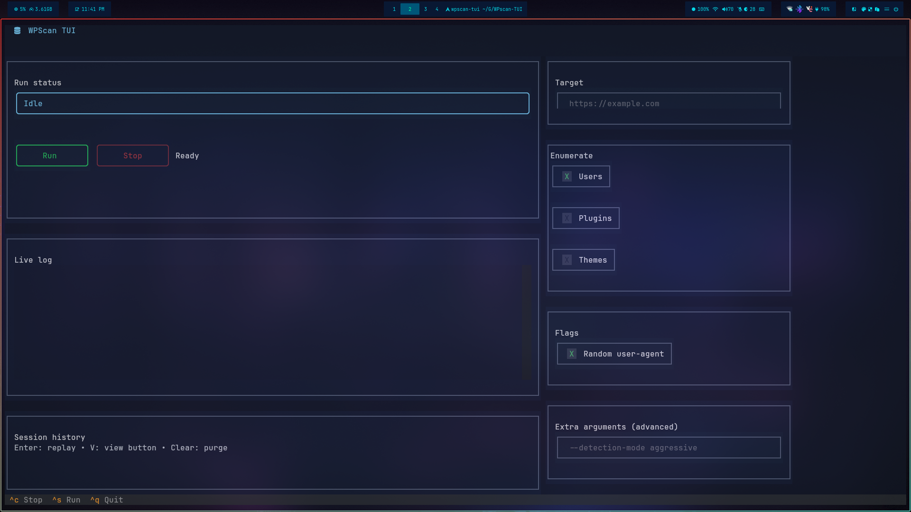

# WPScan TUI



Interface texte (Textual) inspirée des outils “lazy*” pour piloter WPScan confortablement : formulaires, presets utiles, sortie colorée et historique consultable.

## Prérequis
- WPScan installé et dans le `PATH`.
  - Arch Linux : `paru -S wpscan` ou `yay -S wpscan` (ou `pacman -S wpscan` si disponible dans vos dépôts).
- Python ≥ 3.10.
- Pour l’installation isolée : `pipx` (recommandé) ou un virtualenv.

## Installation
Arch applique PEP 668 (environnement “externally-managed”), évitez `pip install .` en global.  
Pour toujours récupérer la dernière version du dépôt GitHub : utilisez directement l’URL git avec pipx.

```bash
# Option 1 – pipx depuis GitHub (dernière version)
pipx install git+https://github.com/Chaos-Tic/WPscan-TUI.git

# Option 2 – pipx sur le clone local
pipx install .

# Option 3 – virtualenv local au projet
python -m venv .venv
source .venv/bin/activate
pip install .

# Option 4 – système (déconseillé)
pip install --break-system-packages .
```

## Lancer
```bash
wpscan-tui
```

### Raccourcis
- `Ctrl+S` : lancer un scan.
- `Ctrl+C` : arrêter le scan courant.
- `Ctrl+Q` : quitter.
- Entrée sur une ligne d’historique : recharger la sortie dans le log.

## Fonctions principales
- Champs pour cible (`--url`) et token API.
- Cases à cocher prêtes à l’emploi :
  - Enum utilisateurs / plugins / thèmes (`-e u,p,t`).
  - Random user-agent, verbose, forcer le scan, ignorer erreurs TLS, ignorer la redirection principale (`--ignore-main-redirect`).
  - Désactiver la mise à jour DB (`--no-update`) par défaut pour éviter les prompts.
  - Sortie couleur (par défaut) ou sans couleur.
- Champ “Extra arguments” pour ajouter n’importe quel flag WPScan (ex. `--detection-mode aggressive`).
- Log en couleur en temps réel (stdout/stderr fusionnés) avec barre de progression, pastilles d’état et temps écoulé au-dessus du panneau de log.
- Historique de session (50 entrées max) stocké dans `~/.local/state/wpscan-tui/history.json` ; purgé automatiquement à la fermeture ou via le bouton Clear ; relecture instantanée dans le panneau de droite.
- Wayland / Hyprland : fonctionne en terminal ; si les couleurs semblent limitées, exportez `COLORTERM=truecolor` avant de lancer `wpscan-tui`.
- Statut clair (succès / code de sortie en rouge si ≠0).

## Exemple d’usage
1. Saisir l’URL cible (ex : `https://example.com`).
2. Laisser “No update” coché pour un démarrage rapide.
3. Cocher “Ignore main redirect” si le domaine redirige vers un autre host.
4. Activer “Verbose” ou ajouter `--detection-mode aggressive` dans “Extra arguments” si besoin.
5. `Ctrl+S` pour lancer ; surveiller le log à droite.
6. En fin de scan, retrouver la ligne dans l’historique et appuyer sur Entrée pour revoir la sortie plus tard.

## Dépannage rapide
- `wpscan not found`: installez WPScan et vérifiez le `PATH`.
- PEP 668 / “externally-managed”: utilisez pipx ou un virtualenv (voir Installation).
- Codes de sortie ≠0 : le statut affiche “Scan finished with exit code X” ; consultez le log pour le détail.
- Sortie illisible avec couleurs : cochez “Plain output” pour forcer le mode sans couleur.

## Développement
```bash
pip install -e .
textual run --dev wpscan_tui.app:WPScanTUI
```
Les scans WPScan fonctionnent hors devserver, mais le live-reload aide pour le style.

## Licence
MIT.
